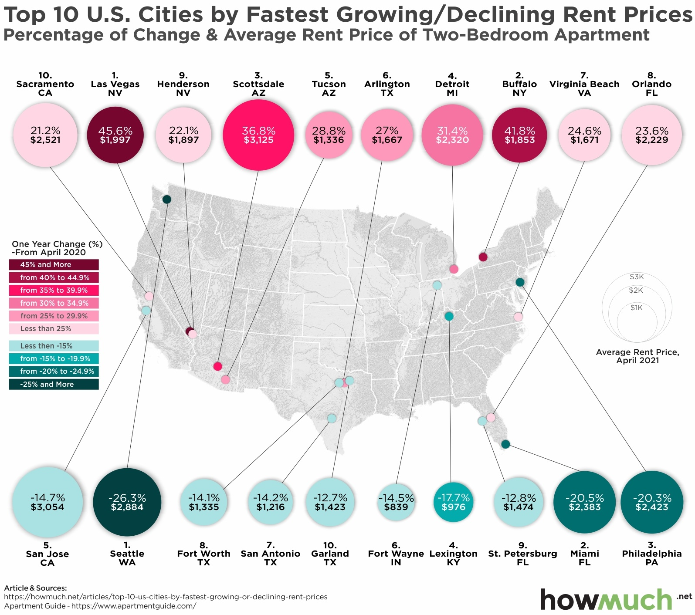

# Module 3
28/08/2026

## Verifying Data Visualizations

### Overview & Reference

* **Reference:** Irena. (2021, June 4). Top 10 U.S. Cities by Fastest Growing and Declining Rent Prices. Retrieved from HowMuch: https://howmuch.net/articles/top-10-us-cities-by-fastest-growing-or-declining-rent-prices 

### Summary of the objective
The objective of this activity was to get us to question the validity and accuracy of the data and visualizations that we use and to not just blindly accept the data as its presented 

---
## Tasks 

### APA-style reference to the data sources 

Katz, L. (2025, March 7). U.S. Asking Rents Rose 0.4% in February—A Small Increase, But the First in 6 Months. Retrieved from Redfin News: https://www.redfin.com/news/rental-tracker-february-2025/ 

(Additional sources) 

Apartment List Research Team. (2026, July 28). Apartment List National Rent Report. Retrieved from Apartment List: https://www.apartmentlist.com/research/national-rent-data 

Bedo, N., & Hale, D. (2021, May 18). April Data: Tech City Rents are Rising Out of their COVID Slump. Retrieved from realtor: https://www.realtor.com/research/april-2021-rent/ 

 

### Variables visually encoded in data visualization 

#### Geographic Location  
Unit: Coordinates  
Level of measurement: Nominal  

#### One year rent price percentage change (from April 2020- 2021)  
Unit: Percentage  
Level of measurement: Ratio

#### Average rent price April 2021  
Unit:  USD  
Level of measurement: Ratio

#### Ranking of highest/lowest  
Unit:  Integer 1-10  
Level of measurement: Ordinal  

---

### The alignment of the data and the question posed 

I believe that there is strong alignment between the data and the question posed as the visualization provides all the necessary information to answer and understand the question. However, there are improvements that could be made for example the central question is about the percentage change in rent prices however the bubble size for each city encodes the rent price as of April 2021. Additionally, the cities are not ordered in sequential rank from 1-10 making it harder for the viewer. 

### Verification of the source data 

The verification of the source data has led me to have zero faith in the accuracy of the original visualization. The source that the data claims to be based off is missing many of the cities present in the visualization (highlighted in red within the excel sheet) even with the cities present in the original source the numbers are wildly different such as LA where the visualization suggests a 45.6% increase and a rent in 2021 of 1997$. Whereas the source states a 14.4% increase and rent of 1445$. Due to the missing values and completely different values, I searched for potential other sources the data may have been derived from. Using the apartment list source, I filled in the data that I couldn’t find in the original as it was the most complete having data from all the cities present in the visualization. However, it still provided completely different numbers such as for the cities present in the most decreased, which all (according to this source) saw an increase in rent cost from April 2020-2021. I attempted to find another source that might more closely match the visualization leading to the realtor sources where according to their data San Jose saw a -10.7% reduction in rent with a 2021 rent of 3,071$ but that is still not what's present on the visualization.  

Overall, I have no confidence in the visualization and am at a bit of a loss as to how these errors might have occurred. 

### Quality of the original data sources 

The original sources seem to be of high-quality all being platforms used for apartment listing and selling. The limitations of the data and explanation as to discrepancies between sites would be that the data seems to be derived from listing made to the sites themselves, and so are not an exact representation of the rental market as a whole. 
