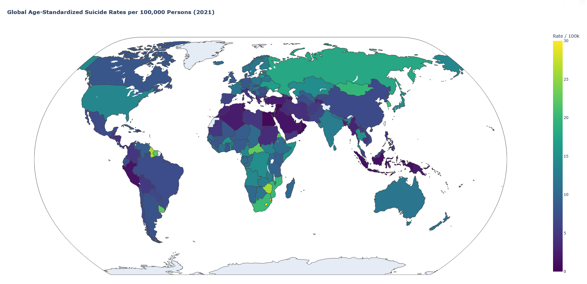

# Module 8
6/10/2026

## Map it

### Created Data Visualization

 

### Summary of the exercise
This exercise served to explore spatial data visualisation 

* Parsed the raw data, filtered to 2021 and removed summary stats
* Built the choropleth plot
* Mapped countries using code provide in the dataset 
---
## Data Card

| Title | Suicide rates across the world |
| ------------ | ------------- |
| Summary      | Estimated annual number of suicides per 100,000 people|
| Data Sources      | World Health Organization (2024) – with major processing by Our World in Data. “Age-standardized death rate from self-harm among both sexes” [dataset]. World Health Organization, “Global Health Estimates” [original data]. https://ourworldindata.org/suicide?insight=suicide-rates-vary-around-the-world#key-insights  |
| Mapping     | •	Spatial map: used natural earth available in plotly   • Colour encoding: Viridis(yellow to purple) deaths per 100k from 0 - 30|
| Important Notes      | •	Data was restricted to 2021 and data summary for regions (i.e Europe) was removed  •	Data is for both sexes and is age standardized |
| Access      | You can get a copy of the data used to build this visualisation by  •	Using the reference above|
